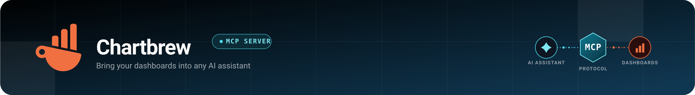

<p align="center">
  <a href="https://github.com/dhavanikgithub/chartbrew-mcp">
    
  </a>
</p>

<p align="center">
  <strong>
    The <a href="https://github.com/dhavanikgithub/chartbrew-mcp">Chartbrew MCP server</a> exposes <a href="https://docs.chartbrew.com/api-reference/introduction">Chartbrew</a>'s documented API to AI coding agents and MCP-compatible clients — letting them list and inspect teams, connections, datasets, dashboards, and charts, run live queries, fetch data, manage share policies/tokens for secure embedding, and create or update resources, all through natural language.
  </strong>
</p>

# Chartbrew MCP Server

TypeScript MCP server built on the official MCP SDK for documented Chartbrew API endpoints.

<p align="center">
  <a href="https://github.com/chartbrew/chartbrew">
    <picture>
      <source media="(prefers-color-scheme: dark)" srcset="assets/dark/chartbrew-logo.svg">
      <source media="(prefers-color-scheme: light)" srcset="assets/light/chartbrew-logo.svg">
      
    </picture>
  </a>
</p>
<p align="center">
<a href="https://docs.chartbrew.com/api-reference/introduction">
  <picture>
    <source media="(prefers-color-scheme: dark)" srcset="assets/dark/chartbrew-docs-logo.png">
    <source media="(prefers-color-scheme: light)" srcset="assets/light/chartbrew-docs-logo.png">
    
  </picture>
</a>
</p>

## Prerequisites

- **Node.js** and **npm** installed (used to install dependencies and build the server).
- A **Chartbrew API key** — create one in your Chartbrew account (cloud or self-hosted). See [How to create API keys in Chartbrew](https://chartbrew.com/blog/how-to-create-api-keys-in-chartbrew).
- For a self-hosted Chartbrew instance, the API base URL of that instance (default `http://localhost:4019`).
- An **MCP-compatible client** to host the server (e.g. Claude Code, Claude Desktop, Cursor, VS Code, Codex, GitHub Copilot, OpenCode, Kimi Code).

## Scope

This server only implements operations documented in the official [Chartbrew API](https://docs.chartbrew.com/api-reference/introduction) reference and avoids undocumented behavior.

Implemented resources:

- Teams: list, get
- Connections: list, get, test, create, update, delete
- Datasets: list, get, fetch data, create, update, delete
- Data Requests: list, run
- Dashboards (projects): list, get, create, update, delete
- Charts: get, create, query, delete

Not implemented in this version:

- Variable binding create/update endpoints

These can be added later if needed.

## Authentication

Chartbrew API docs specify Bearer token authentication.

Required header used by this server:

- Authorization: Bearer <CHARTBREW_API_KEY>

## Configuration Options

| Variable                       | Description                                                                                                                                                                        | Required                                  |
| ------------------------------ | ---------------------------------------------------------------------------------------------------------------------------------------------------------------------------------- | ----------------------------------------- |
| `CHARTBREW_API_KEY`            | Chartbrew API key used for Bearer token authentication                                                                                                                             | Yes                                       |
| `CHARTBREW_API_BASE_URL`       | API base URL. Use `https://api.chartbrew.com` for an official Chartbrew cloud account, or your self-hosted URL (default `http://localhost:4019`; change the port if yours differs) | No (default: `https://api.chartbrew.com`) |
| `CHARTBREW_REQUEST_TIMEOUT_MS` | Request timeout in milliseconds to prevent hanging requests                                                                                                                        | No (default: `30000`)                     |
| `CHARTBREW_TOOL_MODE`          | Tool exposure mode. Allowed values: `restricted`, `unrestricted`. If unset or set to any value other than `unrestricted`, the server runs in `restricted` mode                     | No (default: `restricted`)                |

Tool mode behavior:

- unrestricted: all implemented tools are available.
- restricted: only data-retrieval/query tools are available (list/get/fetch/query/run/test). Create/update/delete tools are disabled.

You can provide these values in either of two ways (pick one):

- **`.env` file in this `mcp` folder** — copy `.env-template` to `.env` and fill in the values. The server auto-loads it on startup.
- **The `env` block of your coding agent's MCP config** — set the variables directly in the `env` object of the server entry (e.g. `.mcp.json` for Claude Code, or the equivalent MCP config for Codex, GitHub Copilot, OpenCode, Kimi Code, etc.). Use this when you don't want a local `.env` file.

## Install

1. Change directory to `mcp`.
2. Install dependencies:

   ```bash
   npm install
   ```

3. Build:

   ```bash
   npm run build
   ```

4. Run

```bash
npm start
```

The server uses stdio transport and is intended to be launched by an MCP client host.

## Add to an MCP client

After `npm install` and `npm run build`, register the server with your MCP host. The server runs over stdio via `node dist/index.js`. Replace `<ABSOLUTE_PATH_TO_MCP_DIR>` with the absolute path to this `mcp` directory and set your API key.

### Claude Code CLI (`claude mcp add`)

If you use Claude Code, you can register the server directly from the terminal instead of editing a config file:

```bash
claude mcp add chartbrew \
  -e CHARTBREW_API_KEY=your-api-key \
  -e CHARTBREW_API_BASE_URL=https://api.chartbrew.com \
  -e CHARTBREW_TOOL_MODE=restricted \
  -- node <ABSOLUTE_PATH_TO_MCP_DIR>/dist/index.js
```

- Use `http://localhost:4019` for `CHARTBREW_API_BASE_URL` on a self-hosted instance (change the port if yours differs).
- Add `-s user` (or `-s project`) to control the scope the server is registered in.
- Verify with `claude mcp list`; remove with `claude mcp remove chartbrew`.

### Claude Desktop / Claude Code (`claude_desktop_config.json` or `.mcp.json`)

```json
{
  "mcpServers": {
    "chartbrew": {
      "command": "node",
      "args": ["<ABSOLUTE_PATH_TO_MCP_DIR>/dist/index.js"],
      "env": {
        "CHARTBREW_API_KEY": "your-api-key",
        "CHARTBREW_API_BASE_URL": "https://api.chartbrew.com",
        "CHARTBREW_TOOL_MODE": "unrestricted"
      }
    }
  }
}
```

### Cursor / VS Code (settings UI → MCP servers)

```json
{
  "mcpServers": {
    "chartbrew": {
      "command": "node",
      "args": ["<ABSOLUTE_PATH_TO_MCP_DIR>/dist/index.js"],
      "env": {
        "CHARTBREW_API_KEY": "your-api-key"
      }
    }
  }
}
```

> **API base URL:** use `https://api.chartbrew.com` for an official Chartbrew cloud account. For a self-hosted instance use your local URL — default `http://localhost:4019` (change the port if yours differs).

Notes:

- `CHARTBREW_API_KEY` is required. See [How to create API keys in Chartbrew](https://chartbrew.com/blog/how-to-create-api-keys-in-chartbrew).
- The MCP host launches the server; it does not need to be run manually.
- The default tool mode is `restricted` (read/query only). Set `CHARTBREW_TOOL_MODE: "unrestricted"` to also enable create/update/delete tools.
- Alternatively, set the env vars in a `.env` file in the `mcp` directory and omit the `env` block.

## Available Tools

| Tool                                        | Category      | Description                                                                                              |
| ------------------------------------------- | ------------- | -------------------------------------------------------------------------------------------------------- |
| `chartbrew_teams_list`                      | Teams         | List teams available to the authenticated API key                                                        |
| `chartbrew_teams_get`                       | Teams         | Get details for one team by `team_id`                                                                    |
| `chartbrew_teams_create`                    | Teams         | Create a new team; owner is derived from the authenticated API key                                       |
| `chartbrew_teams_update`                    | Teams         | Update an existing team by `team_id`                                                                     |
| `chartbrew_connection_providers_list`       | Connections   | List all supported connection providers                                                                  |
| `chartbrew_connections_schema_get`          | Connections   | Get the schema structure for a specific connection                                                       |
| `chartbrew_connections_list`                | Connections   | List all connections in a team                                                                           |
| `chartbrew_connections_get`                 | Connections   | Get one connection by `connection_id`                                                                    |
| `chartbrew_connections_test`                | Connections   | Run the Chartbrew connection test for a team connection                                                  |
| `chartbrew_connections_create`              | Connections   | Create a new connection in a team                                                                        |
| `chartbrew_connections_update`              | Connections   | Update an existing connection                                                                            |
| `chartbrew_connections_update_files`        | Connections   | Upload SSL CA/cert/key files (base64) for a connection via multipart — for PostgreSQL/MySQL SSL/TLS auth |
| `chartbrew_connections_delete`              | Connections   | Delete a connection; optionally remove linked datasets                                                   |
| `chartbrew_datasets_list`                   | Datasets      | List datasets for a team                                                                                 |
| `chartbrew_datasets_get`                    | Datasets      | Get one dataset by `dataset_id`                                                                          |
| `chartbrew_datasets_fetch_data`             | Datasets      | Run a dataset request and return the dataset data                                                        |
| `chartbrew_datasets_create`                 | Datasets      | Create a new dataset in a team                                                                           |
| `chartbrew_datasets_quick_create`           | Datasets      | Create a dataset and all its data requests in a single call                                              |
| `chartbrew_datasets_update`                 | Datasets      | Update an existing dataset by `dataset_id`                                                               |
| `chartbrew_datasets_delete`                 | Datasets      | Delete a dataset                                                                                         |
| `chartbrew_data_requests_list`              | Data Requests | List data requests for a dataset                                                                         |
| `chartbrew_data_requests_run`               | Data Requests | Execute one dataset data request                                                                         |
| `chartbrew_dashboards_list`                 | Dashboards    | List dashboards for a team                                                                               |
| `chartbrew_dashboards_get`                  | Dashboards    | Get dashboard details by `project_id`                                                                    |
| `chartbrew_dashboards_create`               | Dashboards    | Create a new dashboard (Project); private by default                                                     |
| `chartbrew_dashboards_update`               | Dashboards    | Update an existing dashboard by `project_id`                                                             |
| `chartbrew_dashboards_delete`               | Dashboards    | Delete a dashboard by `project_id`                                                                       |
| `chartbrew_dashboards_create_share_policy`  | Dashboards    | Create a share policy for secure sharing via signed URLs                                                 |
| `chartbrew_dashboards_update_share_policy`  | Dashboards    | Update a dashboard share policy (params, `allow_params`, expiration)                                     |
| `chartbrew_dashboards_delete_share_policy`  | Dashboards    | Delete a share policy for a dashboard                                                                    |
| `chartbrew_dashboards_generate_share_token` | Dashboards    | Generate a signed JWT for secure dashboard embedding                                                     |
| `chartbrew_charts_get`                      | Charts        | Get a chart by `project_id` and `chart_id`                                                               |
| `chartbrew_charts_create`                   | Charts        | Create a chart inside a dashboard project                                                                |
| `chartbrew_charts_quick_create`             | Charts        | Create a chart and its chart dataset configurations in a single call                                     |
| `chartbrew_chart_dataset_configs_create`    | Charts        | Attach a dataset to a chart via `ChartDatasetConfig`                                                     |
| `chartbrew_chart_dataset_configs_update`    | Charts        | Update an existing `ChartDatasetConfig` by `cdc_id`                                                      |
| `chartbrew_chart_dataset_configs_delete`    | Charts        | Delete a `ChartDatasetConfig` by `cdc_id`                                                                |
| `chartbrew_charts_query`                    | Charts        | Run the chart query endpoint and return result data                                                      |
| `chartbrew_charts_delete`                   | Charts        | Delete a chart by `project_id` and `chart_id`                                                            |
| `chartbrew_charts_create_share_policy`      | Charts        | Create a share policy for a chart for secure embedding                                                   |
| `chartbrew_charts_update_share_policy`      | Charts        | Update a chart share policy (params, `allow_params`, expiration)                                         |
| `chartbrew_charts_delete_share_policy`      | Charts        | Delete a share policy for a chart                                                                        |
| `chartbrew_charts_generate_share_token`     | Charts        | Generate a signed JWT for secure chart embedding                                                         |
| `chartbrew_charts_get_for_sharing`          | Charts        | Retrieve a chart for embedding via public access or SharePolicy token                                    |

## Known documentation limitations reflected in implementation

- ID types are inconsistent in docs (number vs string), so tool inputs accept strings.
- Some create/update payload required fields are not consistently documented, so payload is typed as flexible object.
- Dataset fetch filters query-object encoding is undocumented; this server sends object values as JSON strings.
- Error response schemas vary by endpoint; parser handles both error and message fields when available.
